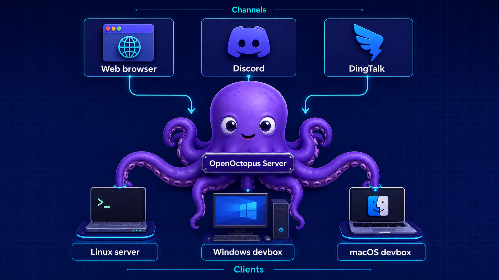
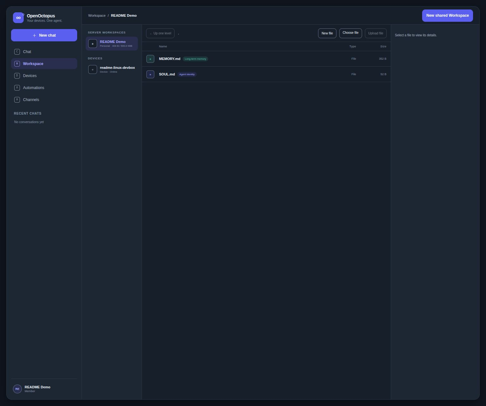
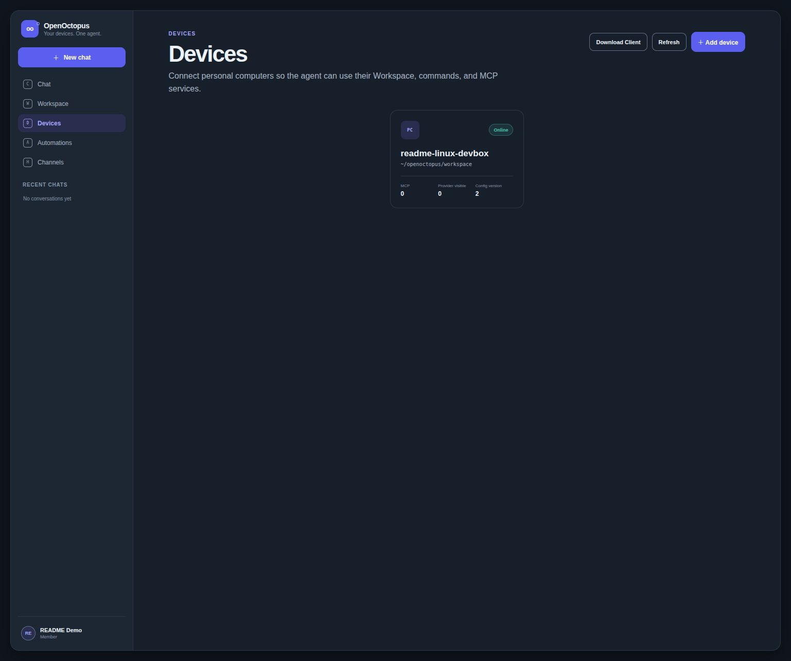
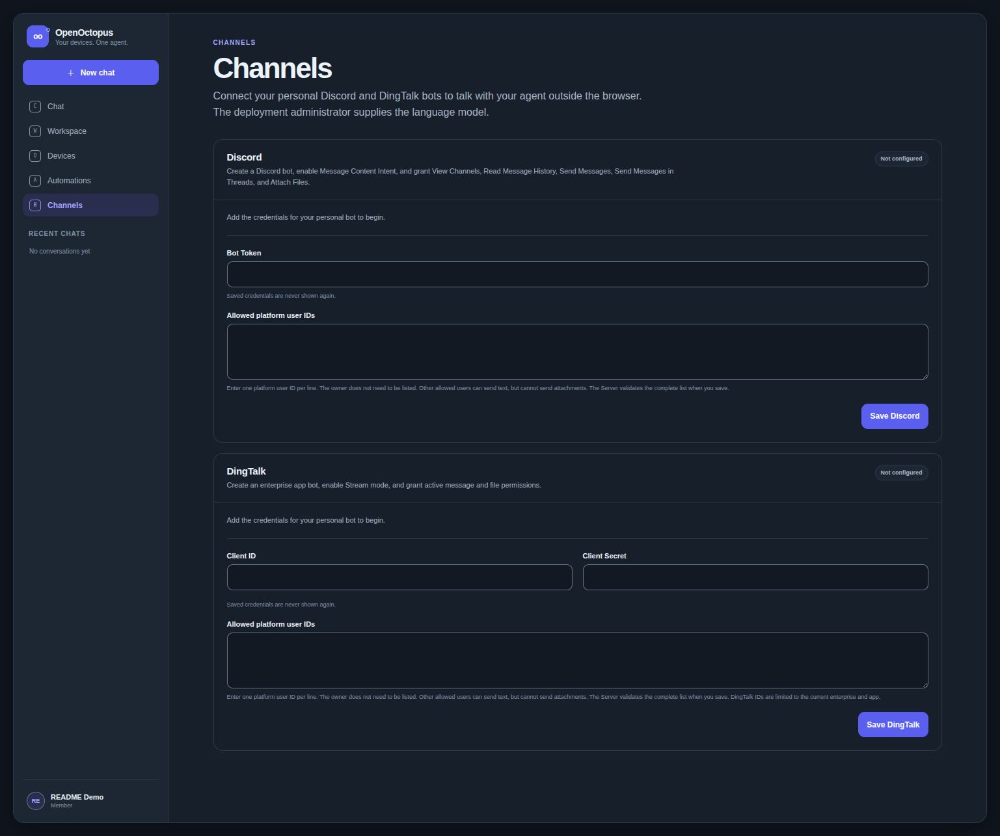

# OpenOctopus

Run one AI agent server and let it work in Server Workspaces or on paired Linux,
macOS, and Windows computers.



> OpenOctopus is an alpha/demo release. Its Client can run commands and local
> MCP services with the permissions of your operating-system user. Read
> [Security and current boundaries](#security-and-current-boundaries) before
> exposing a Server or pairing a computer.

## What it does

- Serves a browser UI and API from the same Docker image.
- Stores durable users, conversations, configuration, and MCP catalogs in
  PostgreSQL, with Server Workspace files in RustFS.
- Provides personal and equal-permission shared Workspaces, file management,
  browser attachments, and transfers between the Server and paired computers.
- Routes file tools and `web_fetch` to the Server or a selected Client.
- Runs pipe commands and line-oriented PTY/ConPTY sessions on paired Clients.
- Connects admin-managed Server MCP and per-device MCP over `stdio`,
  Streamable HTTP, or SSE, including tools, resources, templates, and prompts.
- Connects one Discord Bot and one DingTalk Bot per user to the same durable
  conversation and Agent loop as the browser.
- Uses an Anthropic-compatible Messages API as the LLM Provider.

New accounts receive editable `SOUL.md` and `MEMORY.md` files in their personal
Workspace. Administrators can configure the default SOUL, Provider, Workspace
quotas, Server Web Fetch policy, users, and shared Server MCP from the UI.

## See it in action

### Server Workspace

Browse the Server Workspace alongside paired Clients, then manage files and
agent instructions in one place.



### Paired Clients

Pair a computer once, see whether it is online, and route the Agent to its
Workspace, commands, and MCP services.



### External Channels

Connect a personal Discord or DingTalk Bot to the same durable conversation as
the browser, with owner pairing and an explicit text-only allow list.



## Architecture

```text
Browser
  | REST + best-effort NDJSON stream
  v
OpenOctopus Server (one ASGI worker)
  |-- PostgreSQL: users, conversations, configuration, MCP catalogs
  |-- RustFS: Server Workspaces and uploaded attachments
  |-- Anthropic-compatible LLM Provider
  |-- Discord Gateway + REST adapter
  |-- DingTalk Stream + OpenAPI adapter
  |-- Server-owned MCP connections and stdio child processes
  `-- Protocol v3 WebSocket
        `-- OpenOctopus Client
              |-- local file tools and transfers
              |-- exec: pipes + POSIX PTY / Windows ConPTY
              |-- Client web_fetch
              `-- Device MCP runtimes
```

The Server does not run Client shell commands. Device MCP and Client tools run
on the paired computer. Server MCP is owned by the Server: `stdio` services run
as child processes with the Server OS user's permissions, while HTTP/SSE
services run at their configured remote endpoints.

## Five-minute Docker quickstart

Requirements: Git, Docker, Docker Compose v2, and `curl`.

```bash
git clone https://github.com/Zpoteiti/OpenOctopus.git
cd OpenOctopus
cp .env.example .env
```

Edit `.env` and replace every `replace-with-...` value. In particular, use
independent long random values for the PostgreSQL password, RustFS secret,
JWT signing secret, and administrator registration token.

```bash
docker compose --env-file .env pull
docker compose --env-file .env up -d --wait
curl --fail http://127.0.0.1:8080/health
```

Compose starts PostgreSQL, RustFS, and OpenOctopus, creates the RustFS bucket,
bootstraps the database schema, and preserves both data stores in named volumes.
It listens on `127.0.0.1:8080` by default.

Open <http://127.0.0.1:8080/register>. Register the first administrator with
the value of `OPENOCTOPUS_ADMIN_TOKEN` from `.env`. The same token can create
additional administrators; omit it to create a regular member.

### Configure the LLM Provider

Sign in as an administrator, open **Admin settings**, and configure:

- **API base URL**: the unversioned origin, such as
  `https://api.siliconflow.cn` — do not append `/v1`;
- **API key**;
- **Model**, such as `Qwen/Qwen3.5-4B`;
- the model context window and desired output/compaction limits.

Before saving, OpenOctopus calls `GET {base_url}/v1/models` and verifies that
the configured model exists. Chat then uses the Provider's
Anthropic-compatible `/v1/messages` endpoint. A Provider running on the Docker
host must be addressed by an address reachable from the Server container;
`localhost` inside the container refers to the container itself.

The administrator owns this shared Provider configuration and API key, and
therefore bears Provider usage and cost for browser, channel, Cron, and
Heartbeat turns from every account on the deployment.

### Stop or remove the stack

Stop containers while preserving data:

```bash
docker compose --env-file .env down
```

Delete containers and all local PostgreSQL/RustFS data:

```bash
docker compose --env-file .env down --volumes
```

The second command is destructive.

To build the Server image from the current checkout instead of pulling it:

```bash
docker compose --env-file .env up -d --build --wait
```

## Pair a Client

1. In the browser, open **Devices**, create a device, and save the token shown
   once.
2. Download the native one-folder bundle from
   [GitHub Releases](https://github.com/Zpoteiti/OpenOctopus/releases), or run
   the Client from source.
3. Start it with the Server origin and device token.

Linux and macOS:

```bash
export OPENOCTOPUS_SERVER_URL='http://127.0.0.1:8080'
export OPENOCTOPUS_DEVICE_TOKEN='openoctopus_dev_...'
./openoctopus-client/openoctopus-client run
```

Windows PowerShell:

```powershell
$env:OPENOCTOPUS_SERVER_URL = 'http://127.0.0.1:8080'
$env:OPENOCTOPUS_DEVICE_TOKEN = 'openoctopus_dev_...'
.\openoctopus-client\openoctopus-client.exe run
```

`OPENOCTOPUS_SERVER_URL` must be an HTTP(S) origin without a path, query, or
fragment. Use HTTPS/WSS for a remote Server. See [client/README.md](client/README.md)
for artifact names, source installation, lifecycle, and Client policy details.

## Connect Discord or DingTalk

Open **Channels** in the browser and configure the Bot credential for Discord
or the Client ID and Client Secret for DingTalk. Secrets are write-only. The
DingTalk Client ID is also its `robotCode`; the current API verifies that
identity but does not expose a platform Bot name or avatar, so OpenOctopus
leaves those profile fields unknown instead of inventing platform metadata.

For Discord, enable **Message Content Intent** and grant the Bot **View
Channels**, **Read Message History**, **Send Messages**, **Send Messages in
Threads**, and **Attach Files**. The Channels page shows the same setup list.

The account owner proves their channel identity by sending the one-time pairing
code to the Bot in a direct message. Other people are admitted only when the
owner manually enters their exact platform user IDs in the allow list, one ID
per line. An allow-listed non-owner gets text-only `message` access to the
current conversation or the paired owner's direct message; there is no
agent-to-agent channel protocol.

External channel history is visible in the browser as read-only history. The
Server persists a complete Agent reply before the platform adapter splits it
into bounded Discord or DingTalk messages. Each platform action is issued at
most once and its outcome is stored; partial, failed, or unknown delivery is
not retried automatically. Send a new message in the original channel to start
a new Agent turn and try again.

## Security and current boundaries

- `restrict_to_workspace=true` confines OpenOctopus-resolved file paths and an
  exec session's initial working directory. It is an application path guard,
  not an operating-system sandbox, and it does not constrain shell commands,
  MCP, or networking.
- Exec, PTY/ConPTY, and Device MCP inherit the permissions of the user running
  the Client. Install and pair them only on computers you trust.
- Server and Client `web_fetch` have independent configurable denylists. Exec
  and MCP networking is open by design and can bypass those denylists.
- Server and Device MCP environment variables and HTTP headers are stored in
  PostgreSQL as reversible plaintext and redacted from API responses. Remote
  MCP headers require an HTTPS endpoint; sending secret-bearing Device MCP
  configuration to a Client also requires WSS.
- Attachments from allow-listed non-owners are rejected before any byte
  download, so they cannot reach the owner's Workspace or Client. Attachments
  sent by the paired owner may enter the owner's Workspace as authorized data;
  they are not executed automatically and OpenOctopus does not claim antivirus
  scanning.
- The current Server uses one ASGI worker and process-local coordination. Do
  not run multiple workers or multiple Server replicas against one deployment.
- The release bundles are unsigned, platform-native one-folder applications;
  they are not installers, services, or single static binaries.
- PTY/ConPTY targets line-oriented REPLs and simple prompts. Full-screen TUI
  applications and reliable secret/password entry are outside the current
  support boundary.
- Document conversion supports PDF, DOCX, XLSX, PPTX, and downloaded HTML. OCR,
  audio/video, archive recursion, and direct remote PDF/Office conversion are
  not enabled.
- `/health` checks PostgreSQL and RustFS. Optional MCP runtime status is exposed
  through the corresponding administrator configuration view.

For an Internet-facing deployment, keep OpenOctopus behind a TLS reverse proxy,
use HTTPS/WSS, and set `OPENOCTOPUS_COOKIE_SECURE=true` in a private copy of
`server/.env.example` selected through `OPENOCTOPUS_SERVER_ENV_FILE`.

## Development and verification

Python packages require Python 3.12 or newer. The frontend uses Node.js 24.

Frontend:

```bash
cd frontend
npm ci
npm run generate:api
npm run lint
npm run typecheck
npm test
npm run build
```

Run the Vite frontend against a Docker Server at `127.0.0.1:8080`:

```bash
cd frontend
npm run dev
```

Client:

```bash
cd client
python3.12 -m venv .venv
. .venv/bin/activate
python -m pip install -e '.[dev,build]'
python -m ruff check .
python -m mypy --strict src tests
python -m pytest -q
python -m PyInstaller --noconfirm --clean openoctopus_client.spec
```

Server, with PostgreSQL, RustFS, and the configured bucket available:

```bash
cd server
cp .env.example .env
python3.12 -m venv .venv
. .venv/bin/activate
python -m pip install -e '.[dev]'
python -m pip install -e ../client
ruff check .
mypy src
pytest -v
```

Frontend browser smoke tests additionally require Chromium, the Server test
dependencies, PostgreSQL, RustFS, and the configured bucket:

```bash
cd frontend
npx playwright install --with-deps chromium
npm run e2e
```

CI verifies the Server on Python 3.12 and 3.13, native Client tests and frozen
bundles on Linux x64, macOS arm64/x64, and Windows x64, the frontend unit and
browser suites, and Linux amd64/arm64 Server images.

## Reference

- [HTTP API](docs/API.yaml)
- [Agent tool catalog](docs/TOOLS.md)
- [Client guide](client/README.md)
- [Server environment reference](server/.env.example)

## License

[MIT](LICENSE)
