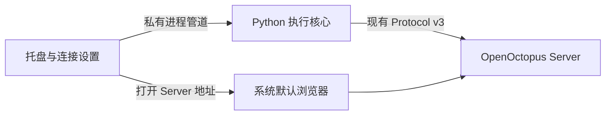

# 托盘常驻 Client 设计

**状态：** 已实现，独立审查与跨平台验收中；尚未合并。
**日期：** 2026-10-04
**代码基线：** `682b22c`
**工作分支：** `refactor-tray-client`。由用户审阅并决定合并。

## 1. 结果与范围

用户安装并双击 OpenOctopus Client 后，程序常驻 Windows 通知区域、macOS
菜单栏或 Ubuntu 的托盘区域。首次运行弹出连接设置；配置完成后只显示托盘图标。
用户通过托盘菜单打开系统默认浏览器中的 Server 前端。

本次交付包含安装包、连接设置、凭据保存、连接状态、单实例、用户登录自启和
完整停止流程。桌面程序运行在当前用户的桌面会话中，使用该用户的权限。
聊天、Workspace 管理、设备创建和 Device MCP 配置继续使用现有网页。

每个操作系统用户只保存一组 Server address / Device token。登录自启默认关闭。
本次不增加 WebView、后台系统服务、多配置切换、自动更新或新的设备管理 API。
直接替换旧的用户启动入口和环境变量配置方式，不提供旧配置迁移或兼容层。

## 2. 当前职责与处理方式

当前 Client 已经有 Python 3.12 / PyInstaller 原生目录包，但分发的是
`tar.gz` / `zip`，配置由 `OPENOCTOPUS_SERVER_URL`、`OPENOCTOPUS_DEVICE_TOKEN`
环境变量提供。核心逻辑与普通用户的启动入口应分别处理。

| 当前职责 | 本次处理 |
| --- | --- |
| [设备连接与 Protocol v3](../../client/src/openoctopus_client/connection.py) | 复用，增加结构化状态事件，调整首次连接失败行为 |
| [文件工具与 Workspace REST 操作](../../client/src/openoctopus_client/tools/file_tools.py) | 保留路径策略、锁、结果与错误契约 |
| [文件传输](../../client/src/openoctopus_client/transfer.py)及[目录任务](../../client/src/openoctopus_client/tools/directory_jobs.py) | 保留校验、提交、取消、跨设备传输和清理 |
| [exec 会话](../../client/src/openoctopus_client/exec_sessions.py)及[原生进程后端](../../client/src/openoctopus_client/process.py) | 保留 pipe、PTY/ConPTY、会话所有权和子进程终止 |
| [Device MCP](../../client/src/openoctopus_client/mcp/supervisor.py) | 保留初始化、发现、调用、配置验证及 generation 隔离 |
| [文档转换](../../client/src/openoctopus_client/document_convert.py)和[web_fetch](../../client/src/openoctopus_client/tools/web_fetch.py) | 保留本地转换与网络访问策略 |
| [CLI / 环境变量入口](../../client/src/openoctopus_client/cli.py) | 用户入口改为托盘；内部 worker 和测试入口按新运行方式调整 |
| [打包与发布](../../.github/workflows/release.yml) | 改为平台安装包，继续执行原生构建与真实核心验收 |

MarkItDown 服务于本地 PDF、DOCX、XLSX、PPTX 读取和下载 HTML 的转换。
继续采用隔离转换进程，保留现有输入、输出、超时和 Linux 资源限制，以及最小
子进程环境。Server 自己的转换实现不替代本地转换，本次不增加原文件上传步骤。

## 3. 最小用户界面

### 启动与连接设置

- 首次启动显示一个小设置窗口：Server address、Device token、“保存并连接”。
- 地址沿用现有 HTTP(S) origin 验证；内部派生 `/ws/device` 和 WS/WSS。
- Token 输入默认隐藏。已有 Token 显示“已保存”；留空表示保留当前凭据，
  不把已保存的 Token 重新填入输入框。
- 更换 Server address 必须重新输入 Token，避免把原 Server 的凭据发给新地址。
- 保存成功才关闭设置窗口并启动连接。保存失败时保留窗口和错误，不启动新配置。
- 已配置的再次启动直接连接，不自动打开网页，也不弹出普通主窗口。
- 关闭设置窗口只隐藏窗口，Client 继续按当前已保存的配置运行；未配置时保持未连接。

### 托盘菜单

| 项目 | 行为 |
| --- | --- |
| 状态：未配置 / 连接中 / 在线 / 重连中 / 已停止 / 需要处理 | 不可点击；错误详情可在连接设置中查看 |
| 打开网页 | 用默认浏览器打开已保存 Server origin；没有地址时打开设置 |
| 连接设置 | 打开同一个设置窗口，可修改地址和 Token |
| 停止客户端 / 启动客户端 | 停止或启动执行核心，托盘程序保留 |
| 登录后自动启动 | 可勾选，默认关闭；只管理当前用户的登录启动项 |
| 退出 | 清理执行核心后退出整个托盘程序 |

菜单同时提供文字和图标状态，不依赖颜色、悬浮提示或系统通知表达错误。
菜单触发方式遵循平台惯例：Windows 右键、macOS 点击菜单栏图标等，不要求统一
双击托盘图标。界面提供中英文文本，按系统语言选择。

“打开网页”不附带 Device token，不替用户完成网页登录。Device token 是设备连接
凭据；现有管理 REST 接口使用用户会话/JWT，两种凭据保持原有职责。

## 4. 桌面程序与执行核心

使用 PySide6 Essentials 的 Qt Widgets 托盘和小设置窗口，配合现有 Python 核心。
只打包所需 Qt 模块和插件，不引入 Qt WebEngine 或整套网页前端。

托盘与执行核心分别运行在两个进程中。GUI 主线程只处理 Qt 事件，异步监听核心
管道；凭据库等可能阻塞的操作在后台完成。GUI 不直接导入或初始化 MCP、文档
转换器和执行会话。核心继续使用 asyncio，不在 Qt 线程中运行现有信号注册逻辑。

GUI 通过 QProcess 启动同一安装目录内的核心程序。Windows 启动核心及 helper 时
不弹出控制台，但核心保留可用的标准输入输出管道。核心的强制退出机制只影响
核心进程，GUI 保持可用并显示结果。

核心程序仍须正确分派 `_conversion-worker`、`_pty-worker` 和冻结构建 smoke 入口。
这些 helper 不加载托盘，不读取系统凭据，不创建第二个 GUI 实例。

### 私有管道约定

采用标准输入/输出上的 UTF-8 JSON 行消息。GUI 发启动配置和停止命令，核心发
结构化状态及终止结果；stderr 只用于有界、脱敏的诊断。GUI 持续消费输出，不能
因管道写满阻塞工具执行，也不通过解析人类日志推断“在线”。

- 每个核心进程只接受一次启动配置，其中包含地址与内存中的 Token。
- GUI 从凭据库读取 Token，通过私有 stdin 管道传入；不写环境变量或命令行参数。
- 状态事件包含状态、稳定错误类别、当前设备名和必要的重试信息，不回传 Token、
  MCP secrets、命令内容或文件内容。Workspace 路径只在设置窗口按需要显示。
- GUI 为每次核心启动分配本地 generation，忽略旧进程的迟到事件。
- 用户切换配置前完成旧核心的停止；任何时刻最多运行一个核心。
- stdin 关闭表示 GUI 所有权结束，核心进入现有完整停止流程。
- 管道消息和诊断缓冲必须有界；具体上限在实现时依据消息模型确定并测试。

这是包内私有接口；Server Protocol v3、工具 schema 和管理 API 不因本次 UI 改变。

## 5. 配置与凭据保存

普通配置使用当前用户的 Qt 标准配置目录，只保存 `server_url` 和凭据引用等非秘密
数据。设置文件使用原子替换；POSIX 文件/目录限制为当前用户，Windows 使用用户
目录权限。登录自启状态以本应用的实际 OS 启动项为准。

Token 使用系统凭据库，通过 keyring 的明确平台后端访问：Windows Credential
Locker、macOS Keychain、Ubuntu Secret Service。仅 GUI 访问凭据库，不采用
第三方后端自动发现或明文文件存储。

新凭据先保存到新的本应用条目，旧核心成功停止后才原子提交地址和凭据引用，
随后启动新核心并删除旧条目。失败时不覆盖当前有效配置，清理未提交的新条目；
旧条目删除失败不撤销已提交的新配置。地址和凭据作为一组切换，不允许半次保存
把旧 Token 与新地址组合使用。首次保存失败保持未配置。凭据保存阶段失败不停止
现有核心；停止/提交阶段失败保留旧配置并显示实际运行状态，不承诺恢复已停止任务。

凭据库锁定、不可用、拒绝访问或凭据缺失时，显示“需要处理”，提供可见错误和
重试入口；不默默转换存储方式，也不自动连接。普通网络失败不删除已保存 Token。
日志、异常报告、子进程环境及自启登记中都不得包含 Token。

## 6. 连接状态与生命周期

| 状态/事件 | 要求 |
| --- | --- |
| 未配置或凭据不可用 | 保留 GUI；说明需要设置或恢复凭据库 |
| 连接中 | 正在连接和握手，不提前宣称在线 |
| 在线 | 匹配的 hello/config-applied acknowledgement 已完成；显示 Server 返回的设备名 |
| 首次 Server 不可达、普通掉线、429/可重试服务错误 | 核心内使用现有有界指数退避，显示重试状态，直到用户停止或遇到永久错误 |
| 认证失败、Token 撤销、连接被替换、协议或配置拒绝 | 停止核心并清理；GUI 保留错误，等待用户修改配置或显式重试 |
| 核心异常退出 | GUI 显示错误；不无限创建新核心进程 |
| 用户停止 | 关闭连接并停止本核心拥有的 exec、MCP、传输、目录任务和转换 helper；完成后显示已停止 |
| 用户再次启动 | 从保存配置创建新的核心；不恢复或重放旧任务 |
| 用户退出、系统退出登录/关机 | 请求完整停止，再释放托盘和单实例所有权 |

“在线”表示设备连接可用，不保证每项 MCP 当前都可用。保持现有 Device MCP 的
独立注册/READY 契约，具体管理状态继续在网页查看。

普通网络断连沿用当前语义：可继续存活的 exec/MCP 会话不因 GUI 改造而重建；
传输与目录任务按原有断连契约清理。结果不确定的已发操作不自动重放。

停止期间禁用重复启动和配置提交。只有核心已退出且正常清理结果得到确认，
才报告停止完成。沿用核心已有停止时限；强制退出或清理未完成显示失败，不把
杀掉核心进程等同于成功清理。异常路径的进程树清理须在原生平台验收，确认前
不得启动替代核心。系统强制杀进程或断电不承诺优雅清理。

## 7. 单实例与桌面环境

单实例按当前 OS 用户和应用标识隔离，用用户目录内的 QLockFile 仲裁，配合
本地 socket 唤起已有设置窗口。唤起通道只接受激活请求，不接收凭据或执行请求；
限制为当前用户访问，POSIX socket 放在用户私有目录内。重复启动不读取凭据、
不连接 Server、不抢占已有 Device 连接。启动竞争和陈旧锁/socket 必须测试。

用 `QSystemTrayIcon.isSystemTrayAvailable()` 检测托盘。Ubuntu/GNOME 的支持
依赖桌面配置；macOS 用菜单栏应用模式，不常驻 Dock。托盘不可用时显示同一个
设置窗口和“托盘不可用”的提示，停止后台连接，允许重试检测或退出。运行中
托盘支持消失也恢复可见入口；程序不自行安装或启用 GNOME 扩展。

设置窗口关闭时关闭 Qt 的“最后窗口退出”行为；真正退出由托盘的退出动作控制。
无托盘时不能隐藏唯一窗口后留下不可操作的进程。系统通知仅辅助提示。

## 8. 登录自启

仅使用当前用户的 OS 登录启动机制，启动参数不携带秘密，默认关闭：

| 平台 | 机制 |
| --- | --- |
| Ubuntu | 用户 XDG autostart `.desktop`，目标为已安装程序，含目标存在检查 |
| Windows | 当前用户 `HKCU` Run 项，使用已安装 GUI 的绝对路径 |
| macOS | 当前用户 LaunchAgent，在图形登录会话启动应用，不设持续重启 |

启动项操作成功后才改变勾选状态；失败保留实际状态并显示原因。重复切换、升级
后路径、禁用后的再次登录都须验证。用户停止核心只影响当前运行；下次显式启动
或登录自启仍按保存配置连接。退出程序不自动取消用户已启用的登录自启。

GUI 从桌面启动时不假定继承交互式 shell 的 PATH 或初始化脚本。Device MCP
命令继续使用桌面 PATH 或现有 MCP 配置的绝对路径，缺失时返回原有可执行文件
错误；不额外执行 shell 初始化文件或增加本地 MCP 配置。

## 9. 安装包与发布

延续当前平台架构：Linux x64、Windows x64、macOS arm64/x64。第一轮 Linux
验收覆盖现有 Ubuntu 24.04 构建环境和本机 Ubuntu 26.04 / GNOME；其他 Linux
发行版和桌面不扩展支持声明。

| 平台 | 用户交付物 |
| --- | --- |
| Ubuntu | `.deb`，安装程序、图标、应用菜单入口及准确的系统依赖 |
| Windows | 每用户 `.exe` 安装器，安装完整冻结目录和启动快捷方式 |
| macOS | `.dmg` 内的 `.app`，包含 GUI、核心与所有需要的资源 |

继续以 PyInstaller 的目录构建为基础，安装器交付完整目录。用户不需要安装 Python、
pip 或 Qt。Qt 的显示插件、keyring 后端、MarkItDown 资源及 Windows ConPTY/DLL
都须显式验证。GUI 和核心的两个入口共用可共用的资源，避免重复整套依赖。

在目标 OS 原生构建，不把交叉打包视为原生验收。沿用当前版本一致性和 release
acceptance 门槛，更新产物收集与 smoke 的可执行路径。旧 archive/环境变量运行
说明被新安装启动流程替换，内部测试直接通过私有管道启动核心。

本轮开发交付延续现有未签名状态；macOS Gatekeeper、Windows 系统提示如实写入
安装说明，不承诺免提示。发布签名和公证未纳入本次范围。

## 10. 实现顺序与验收

1. **核心状态和私有入口**：验证首次失败后重试、真实握手后才在线、永久错误
   停止、stdin 关闭停止、helper 分派和迟到状态隔离。保留现有协议/生命周期测试。
2. **托盘、设置与凭据**：验证首次配置、保存后重启、修改地址必须换 Token、
   保存失败不覆盖现有配置、凭据库不可用、窗口关闭、单实例和托盘不可用。
3. **原生安装与自启**：从安装包启动，验证无终端、真实图标和菜单、默认浏览器
   打开正确 origin、登录自启开关、升级/卸载及停止后的子进程清理。
4. **真实能力回归**：安装后的核心连接真实 Server，执行文档读取、文件工具、
   web_fetch、exec/PTY、stdio 与 HTTP MCP、Server/Client 和 Client/Client 文件及
   目录传输，并测试过程中停止及 Token 撤销。适配已有 E2E，不另写一套替代实现。

CI 继续执行 Client lint、严格类型检查、源测试、原生冻结 smoke 及相关真实
Server E2E。Qt offscreen 测试只验证 UI 逻辑；不能证明系统托盘、凭据库、默认
浏览器或实际登录自启正常。Windows/macOS 桌面验收没有完成时必须标为未验证，
不能用构建通过代替。安装器测试也不能只检查文件后缀或压缩包存在。

“轻量化”用实际构建衡量：记录压缩安装包/安装后大小、冷启动时间、GUI 与核心
的空闲进程树内存及 CPU，并与旧核心基线比较。文档转换和 MCP 进程按需启动。
本草案不预设未经测量的 MB 或启动秒数上限；如果 Qt 的实际开销不合适，在
继续实现前更新选型与测量结果供审阅。

## 11. 代码与文档边界

新增桌面入口、设置/凭据、单实例/自启和小型进程控制模块；已有工具、执行后端、
MCP 和传输模块仅为生命周期接入作必要修改，不顺带重写或整理。

实现时更新 Client README、根 README、配对 built-in skill、安装发布说明、冻结
smoke 和现有 E2E 启动 helper。Server 业务逻辑、管理网页和公开协议无需新增能力。
spec 审阅通过才开始实现；实现完成后提交分支供用户审阅，不自行合并。

## 12. 核对的官方资料

- [Qt 系统托盘](https://doc.qt.io/qt-6/qsystemtrayicon.html)：平台支持、托盘检测及
  macOS/GNOME 的交互差异。真实桌面仍需原生验收。
- [Qt QProcess](https://doc.qt.io/qt-6/qprocess.html)：子进程管道与异步输出处理。
- [Qt 本地 socket](https://doc.qt.io/qt-6/qlocalserver.html)：本地激活通道及平台权限
  差异；用户私有目录不能被只设置 socket 权限替代。
- [keyring](https://keyring.readthedocs.io/en/latest/)：三平台系统凭据后端；被冻结
  应用中能否正常访问必须单独验证。
